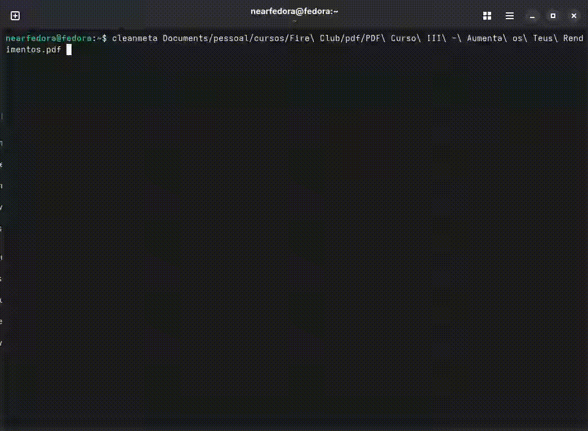
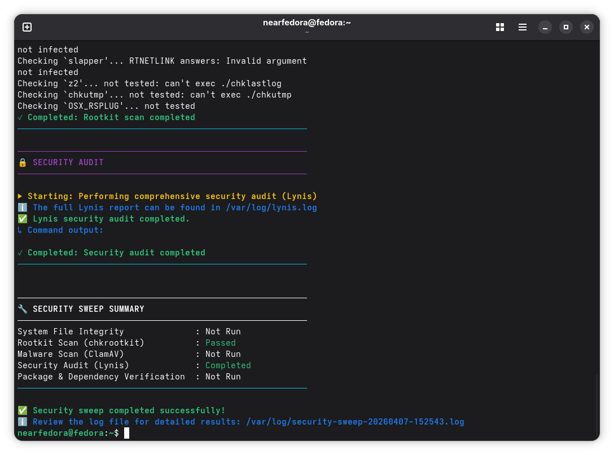
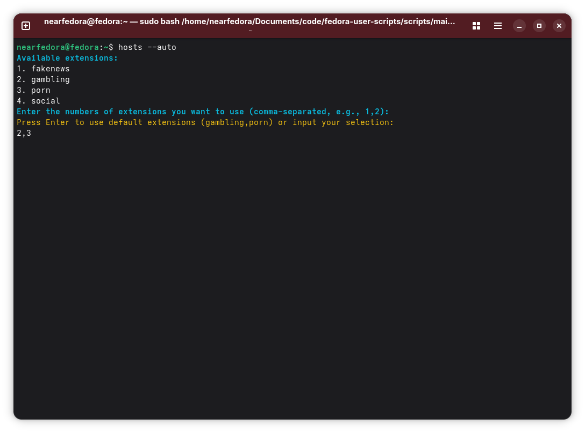
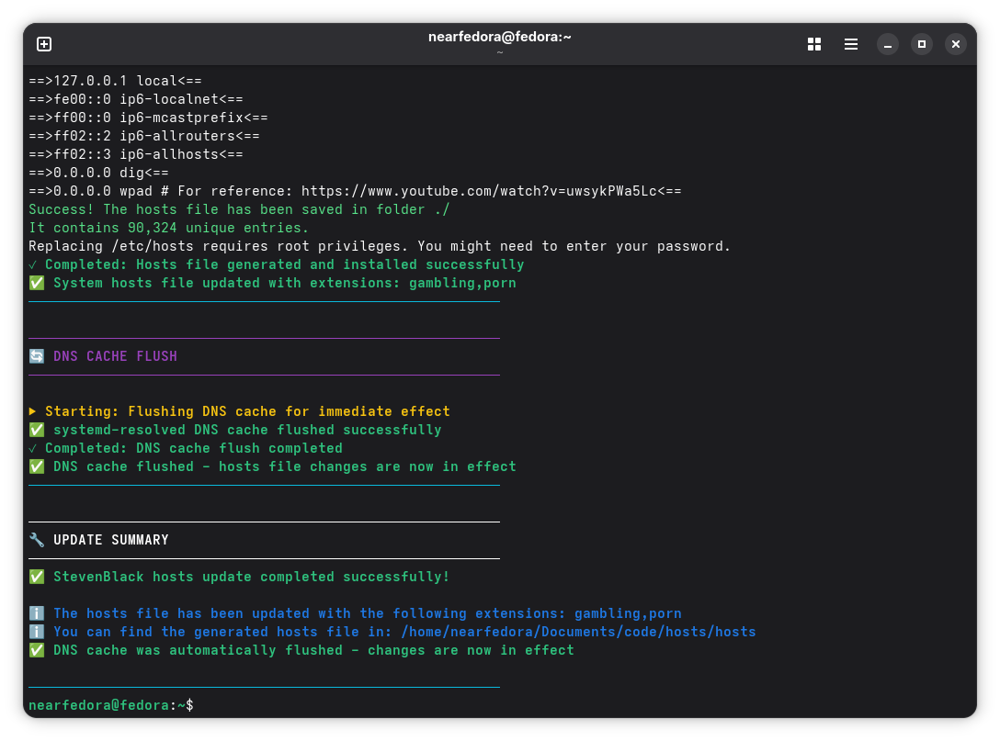
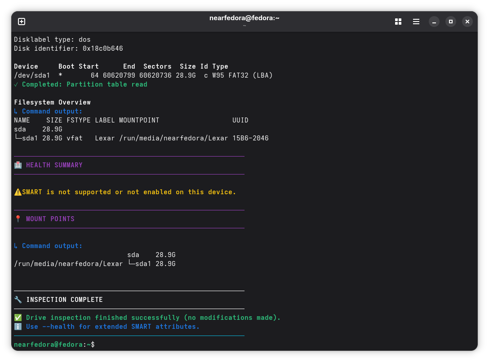

# Fedora User Scripts Collection

A collection of personal utility scripts **optimized for Fedora Linux systems**.

[](https://opensource.org/licenses/MIT)
[](https://getfedora.org/)

## Overview

This repository contains shell scripts designed specifically for Fedora environments, with a focus on system maintenance, security, and file management utilities.

## Scripts

### clean-metadata.sh
- **Purpose:** Cleans metadata from PDF, PNG, and JPEG files and optimizes them
- **Usage:** `scripts/maintenance/clean-metadata.sh [OPTIONS] <file|directory> [...]`
- **Dependencies:** `exiftool`, `gs`, `pngquant`, `jpegoptim`, `numfmt`, `shred`
- **Options:** `--help`, `--replace`, `--verbose`, `--clean`, `--optimize`
- **Demo:** 

### fedora-update.sh
- **Purpose:** Performs weekly maintenance on Fedora systems, including package updates and cache cleaning
- **Usage:** `scripts/maintenance/fedora-update.sh`
- **Dependencies:** `dnf` or `dnf5`, `flatpak` (optional), `sudo`, `stat`
- **Note:** Interactive completion menu offers restart/shutdown options
- **Demo:** 

### secure-delete.sh
- **Purpose:** Securely deletes files and directories by overwriting them with random data
- **Usage:** `scripts/security/secure-delete.sh <file|directory> [...]`
- **Dependencies:** `shred`, `find`, `rm`

### security-sweep.sh
- **Purpose:** Performs comprehensive security sweep on Fedora systems, checking file integrity, rootkits, malware, and auditing security configurations
- **Usage:** `sudo scripts/security/security-sweep.sh [OPTIONS]`
- **Dependencies:** `rpm`, `dnf` or `dnf5`, `chkrootkit`, `clamav`, `clamav-update`, `lynis`
- **Options:** `-i` (integrity), `-r` (rootkit), `-m` (malware), `-a` (audit), `-p` (packages), `-e` (exclude home), `-h` (help)
- **Note:** Requires root privileges; creates logs in `/var/log/`
- **Screenshot:** 

### run-searxng.sh
- **Purpose:** Runs SearXNG instance using Python virtual environment
- **Usage:** `scripts/searxng/run-searxng.sh`
- **Dependencies:** python3, virtual environment, SearXNG installation at $HOME/Documents/code/searxng/
- **Demo:** 

### update-searxng.sh
- **Purpose:** Updates SearXNG instance by pulling latest changes from git repository
- **Usage:** `scripts/searxng/update-searxng.sh`
- **Dependencies:** `git`
- **Note:** This script is included in `scripts/maintenance/fedora-update.sh`

### update-hosts.sh
- **Purpose:** Updates StevenBlack hosts repository with customizable extensions for blocking unwanted content
- **Usage:** `scripts/maintenance/update-hosts.sh`
- **Dependencies:** `git`, `python3`, StevenBlack/hosts repository
- **Note:** Interactive extension selection with automatic hosts file installation
- **Screenshot:**  

### update-ollama-openwebui.sh
- **Purpose:** Updates Ollama and Open Web UI installations with automatic backup
- **Usage:** `scripts/ai/update-ollama-openwebui.sh [OPTIONS]`
- **Dependencies:** `podman`, `curl`, `systemctl`, `tar`
- **Options:** `--backup-only`, `--restore`, `--restore-date`, `--no-backup`, `--help`
- **Note:** Creates backups before updating; preserves models and configurations

### start-ollama-openwebui.sh
- **Purpose:** Starts Ollama and Open Web UI services
- **Usage:** `scripts/ai/start-ollama-openwebui.sh`
- **Dependencies:** `podman`, `systemctl`
- **Note:** Starts both services; press Ctrl+C to stop both

### drive-check.sh
- **Purpose:** Inspects storage drives for comprehensive info (model, capacity, USB version/speed, partitions, SMART health) without making any modifications
- **Usage:** `sudo scripts/hardware/drive-check.sh [OPTIONS] <device>`
- **Dependencies:** `lsblk`, `fdisk`, `blockdev`, `lsusb`, `smartctl` (smartmontools, optional)
- **Options:** `--health` (extended SMART), `--help`
- **Note:** Read-only; requires root privileges for full device access
- **Screenshot:** 

### clean-downloads.sh
- **Purpose:** Sorts files in Downloads into categorized subdirectories by type, with optional age-based purge
- **Usage:** `scripts/maintenance/clean-downloads.sh [OPTIONS] [directory]`
- **Dependencies:** `file`
- **Options:** `--organize`, `--purge <days>`, `--dry-run`, `--help`
- **Note:** Default target is `~/Downloads`; use `--dry-run` to preview changes

## Documentation

### 📚 [Documentation Hub](docs/README.md)
Comprehensive documentation with guides, API reference, and examples

### 🚀 [Quick Start Guide](docs/QUICK_START.md)
Get up and running in 5 minutes!

### 📖 [Guides](docs/guides/)
Detailed documentation for each script:
- [Clean Metadata Guide](docs/guides/clean-metadata-guide.md)
- [Clean Downloads Guide](docs/guides/clean-downloads-guide.md)
- [Fedora Update Guide](docs/guides/fedora-update-guide.md)
- [SearXNG Guide](docs/guides/searxng-guide.md)
- [Security Sweep Script Guide](docs/guides/security-sweep-guide.md)
- [Update Hosts Guide](docs/guides/update-hosts-guide.md)
- [Ollama and Open Web UI Update Guide](docs/guides/ollama-openwebui-guide.md)
- [Ollama and Open Web UI Start Guide](docs/guides/start-ollama-openwebui-guide.md)
- [Drive Check Guide](docs/guides/drive-check-guide.md)

### ❓ [FAQ](docs/FAQ.md)
Frequently asked questions and troubleshooting

### 📋 [Contributing Guide](CONTRIBUTING.md)
Guide for contributing to the project

## System Requirements

These scripts are designed for **Fedora Linux** distributions. While some scripts may work on other RPM-based systems, they are specifically tested and optimized for:

- ✅ Fedora 42
- ✅ Fedora 43
- ❓ Other versions (untested)

## Installation

### Quick Start

1. Clone the repository:
```bash
git clone https://github.com/neardaniel-pls/fedora-user-scripts.git
cd fedora-user-scripts
```

2. Make scripts executable:
```bash
chmod +x scripts/**/*.sh
```

3. Install dependencies (see individual script documentation):
```bash
# Check for common dependencies
sudo dnf install exiftool ghostscript pngquant jpegoptim coreutils chkrootkit clamav clamav-update lynis bleachbit
```

### Setting Up Aliases (Optional)

For convenience, you can add these aliases to your `~/.bashrc` file:

```bash
# Fedora User Scripts aliases
alias update='sudo bash "$HOME/Documents/code/fedora-user-scripts/scripts/maintenance/fedora-update.sh"'
alias cleanmeta='bash "$HOME/Documents/code/fedora-user-scripts/scripts/maintenance/clean-metadata.sh"'
alias updatehosts='bash "$HOME/Documents/code/fedora-user-scripts/scripts/maintenance/update-hosts.sh"'
alias searxng='bash "$HOME/Documents/code/fedora-user-scripts/scripts/searxng/run-searxng.sh"'
alias update_searxng='bash "$HOME/Documents/code/fedora-user-scripts/scripts/searxng/update-searxng.sh"'
alias security='sudo bash "$HOME/Documents/code/fedora-user-scripts/scripts/security/security-sweep.sh"'
alias ai_update='bash "$HOME/Documents/code/fedora-user-scripts/scripts/ai/update-ollama-openwebui.sh"'
alias ai_start='bash "$HOME/Documents/code/fedora-user-scripts/scripts/ai/start-ollama-openwebui.sh"'
alias drivecheck='sudo bash "$HOME/Documents/code/fedora-user-scripts/scripts/hardware/drive-check.sh"'
alias cleandl='bash "$HOME/Documents/code/fedora-user-scripts/scripts/maintenance/clean-downloads.sh"'
```

After adding these aliases, reload your shell with `source ~/.bashrc` or restart your terminal.

## Contributing

Contributions are welcome! Please see [CONTRIBUTING.md](CONTRIBUTING.md) for detailed guidelines.

### Quick Contribution Guide

1. Fork the repository
2. Create a feature branch
3. Make your changes
4. Submit a pull request

## License

This project is licensed under the MIT License - see the [LICENSE](LICENSE) file for details.

## Support

- 🐛 [Report Bugs](https://github.com/neardaniel-pls/fedora-user-scripts/issues/new?template=bug_report.md)
- 💡 [Request Features](https://github.com/neardaniel-pls/fedora-user-scripts/issues/new?template=feature_request.md)

---

## Related Projects

Check out these other companion projects:

- **[fedora-system-setup](https://github.com/neardaniel-pls/fedora-system-setup)**: Comprehensive post-installation guide for Fedora Linux systems with essential configurations, repositories, drivers, and applications

- **[fedora-ai-setup](https://github.com/neardaniel-pls/fedora-ai-setup)**: Collection of guides for setting up AI, machine learning, and LLM tools on Fedora Linux systems

- **[near-whisper](https://github.com/neardaniel-pls/near-whisper)**: Free and open source GUI for local Whisper audio transcription on Fedora Linux systems
