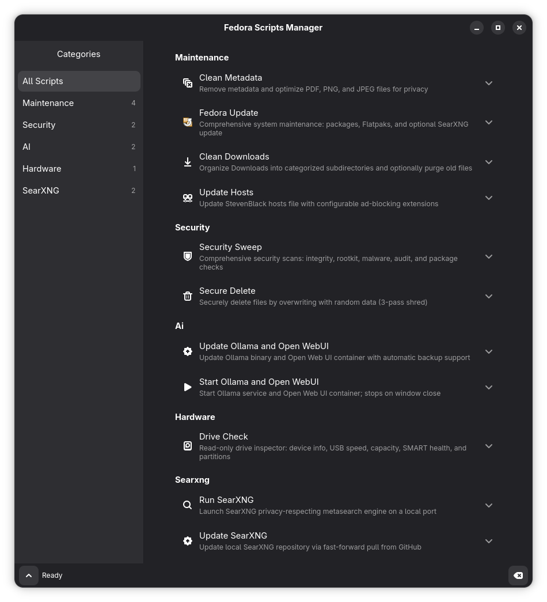

# GUI & Desktop Integration Guide

This guide covers the **Fedora Scripts Manager** GUI application and the **Nautilus context menu** integration for running scripts without a terminal.

---

## Overview

There are two desktop integration features:

1. **Fedora Scripts Manager** — A native GNOME (GTK4/Libadwaita) application that provides a graphical interface for all scripts
2. **Nautilus Context Menu** — Right-click files in Nautilus to run `clean-metadata.sh` directly

---

## Installation

### Prerequisites

Fedora 42, 43, or 44 with GNOME desktop.

### Install Dependencies

```bash
sudo dnf install nautilus-python python3-gobject gtk4 libadwaita zenity
```

Optional (for interactive script support in the GUI):
```bash
sudo dnf install vte291
```

| Package | Required | Purpose |
|---------|----------|---------|
| `nautilus-python` | Yes | Nautilus context menu extension |
| `python3-gobject` | Yes | Python GTK bindings |
| `gtk4` | Yes | GUI toolkit |
| `libadwaita` | Yes | GNOME-native look and feel |
| `zenity` | Yes | Desktop notifications from Nautilus extension |
| `vte291` | No | Embedded terminal for interactive scripts (fallback: gnome-terminal) |

### Run the Installer

From a regular terminal (not inside VSCodium/Flatpak):

```bash
cd ~/Documents/code/fedora-user-scripts
./setup.sh install
```

The installer will:
1. Check all dependencies (and offer to install missing ones)
2. Copy the Nautilus extension to `~/.local/share/nautilus-python/extensions/`
3. Copy the GUI app to `~/.local/share/fedora-scripts-manager/`
4. Create a `.desktop` file in `~/.local/share/applications/`
5. Set `FEDORA_SCRIPTS_DIR` in your config
6. Restart Nautilus

### Other Commands

```bash
./setup.sh update      # Re-install after git pull
./setup.sh uninstall   # Remove all installed components
```

---

## Using the GUI App

### Launching

```bash
python3 ~/.local/share/fedora-scripts-manager/run.py
```

### Interface Overview



The window has three sections:

- **Left sidebar** — Filter scripts by category (All, Maintenance, Security, AI, Hardware, SearXNG)
- **Main area** — Script cards with options, file pickers, and Run buttons
- **Bottom panel** — Output viewer (expandable) showing real-time script output

### Script Types

Scripts behave differently in the GUI depending on their type:

**One-shot scripts** (Clean Metadata, Security Sweep, etc.):
- Click **Run** to execute
- Output streams to the bottom panel
- Status shows success/failure when done

**Long-running services** (Start Ollama, Run SearXNG):
- Click **Start** to begin, **Stop** to end
- Output streams continuously until stopped
- Other scripts are disabled while a service is running

**Interactive scripts** (Fedora Update, Update Hosts):
- Run in an embedded terminal (Vte) with a real PTY
- You can type directly into the terminal for interactive prompts
- If Vte is not installed, they launch in a separate `gnome-terminal` window

### Script Options

Each script card may have configurable options:

- **Toggles** — Checkboxes to enable/disable CLI flags
- **Spin buttons** — Numeric values (e.g., purge age in days)
- **Entry fields** — Text input (e.g., backup date, device path)
- **File pickers** — Browse for files or directories
- **Confirmation dialogs** — Shown for destructive operations (e.g., Replace Original, Skip Backup)

### Sudo / Administrator Access

Scripts that require root privileges (Fedora Update, Security Sweep, Update Hosts, Drive Check) automatically use `pkexec` for authentication. A polkit dialog will appear asking for your password.

---

## Using the Nautilus Context Menu

### Clean Metadata from Files

1. Open Nautilus (Files)
2. Select one or more PDF, PNG, or JPEG files
3. Right-click → **"Clean Metadata"**
4. The script runs in the background
5. A desktop notification appears when done (success or failure)

### Supported File Types

| Format | MIME Type |
|--------|-----------|
| PDF | `application/pdf` |
| PNG | `image/png` |
| JPEG | `image/jpeg` |

### How It Works

- Files are passed to `clean-metadata.sh` with `NO_COLOR=1`
- Output is captured to a temporary log file
- A success notification shows the count of files processed
- On failure, the notification includes the log file path for debugging
- The menu item only appears when at least one selected file is a supported type

---

## Configuration

The GUI and Nautilus extension both read from the shared config file:

```
~/.config/fedora-user-scripts/config.sh
```

The `setup.sh install` command automatically sets `FEDORA_SCRIPTS_DIR` in this file. If you move the repository, update this value or re-run `./setup.sh install`.

---

## Troubleshooting

### GUI doesn't launch
- Verify dependencies: `rpm -q python3-gobject gtk4 libadwaita`
- Run from terminal to see error messages: `python3 ~/.local/share/fedora-scripts-manager/run.py`

### Context menu doesn't appear
- Verify nautilus-python is installed: `rpm -q nautilus-python`
- Restart Nautilus: `nautilus -q`
- Check the extension is installed: `ls ~/.local/share/nautilus-python/extensions/fedora-scripts-extension.py`

### "Script not found" error
- Re-run `./setup.sh install` to update `FEDORA_SCRIPTS_DIR`
- Verify the path in `~/.config/fedora-user-scripts/config.sh`

### Interactive scripts don't work in GUI
- Install Vte: `sudo dnf install vte291`
- Without Vte, interactive scripts open in a separate terminal window instead

### Changes after git pull
- Re-run: `./setup.sh update`

---

## Uninstallation

```bash
./setup.sh uninstall
```

This removes:
- The Nautilus extension
- The GUI app (`~/.local/share/fedora-scripts-manager/`)
- The `.desktop` file

Your config file at `~/.config/fedora-user-scripts/config.sh` is preserved.
